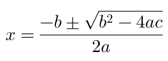

# iosMath

[](https://travis-ci.org/kostub/iosMath)
[](http://cocoapods.org/pods/iosMath)
[](http://cocoapods.org/pods/iosMath)
[](http://cocoapods.org/pods/iosMath)

`iosMath` is a library for displaying beautifully rendered math equations
in iOS and MacOS applications. It typesets formulae written using the LaTeX in
a `UILabel` equivalent class. It uses the same typesetting rules as LaTeX and
so the equations are rendered exactly as LaTeX would render them.

It is similar to [MathJax](https://www.mathjax.org) or
[KaTeX](https://github.com/Khan/KaTeX) for the web but for native iOS or MacOS
applications without having to use a `UIWebView` and Javascript. More
importantly, it is significantly faster than using a `UIWebView`.

## Examples
Here are screenshots of some formulae that you could render with this
library:

 


The [EXAMPLES.md](./EXAMPLES.md) file contains more examples.
 
## Requirements
`iosMath` works on iOS 6+ or MacOS 10.8+ and requires ARC to build. It depends
on the following Apple frameworks:

* Foundation.framework
* CoreGraphics.framework
* QuartzCore.framework
* CoreText.framework

Additionally for iOS it requires:
* UIKit.framework

Additionally for MacOS it requires:
* AppKit.framework

## Installation

### Cocoapods

iosMath is available through [CocoaPods](http://cocoapods.org). To install
it:

1. Add a entry for iosMath to your Podfile: `pod 'iosMath'`.
2. Install the pod by running `pod install`.

### Static library

You can also add iosMath as a static library to your project or
workspace.

1. Download the [latest code version](https://github.com/kostub/iosMath/downloads) or add the
repository as a git submodule to your git-tracked project.
2. Open your project in Xcode, then drag and drop
   `iosMath.xcodeproj` onto your project or workspace (use the
"Product Navigator view").
3. Select your target and go to the Build phases tab. In the Link Binary
   With Libraries section select the add button. On the sheet find and
add `libIosMath.a`. You might also need to add `iosMath` to
the Target Dependencies list.
4. Add the `MathFontBundle` to the list of `Copy Bundle Resources`.
5. Include IosMath wherever you need it with `#import <IosMath/IosMath.h>`.

## Usage

The library provides a class `MTMathUILabel` which is a `UIView` that
supports rendering math equations. To display an equation simply create
an `MTMathUILabel` as follows:

```objective-c
#import "MTMathUILabel.h"

MTMathULabel* label = [[MTMathUILabel alloc] init];
label.latex = @"x = \\frac{-b \\pm \\sqrt{b^2-4ac}}{2a}";

```
Adding `MTMathUILabel` as a sub-view of your `UIView` as will render the
quadratic formula example shown above.

### Included Features
This is a list of formula types that the library currently supports:

* Simple algebraic equations
* Fractions and continued fractions
* Exponents and subscripts
* Trigonometric formulae
* Square roots and n-th roots
* Calculus symbos - limits, derivatives, integrals
* Big operators (e.g. product, sum)
* Big delimiters (using \\left and \\right)
* Greek alphabet
* Combinatorics (\\binom, \\choose etc.)
* Geometry symbols (e.g. angle, congruence etc.)
* Ratios, proportions, percents
* Math spacing
* Overline and underline
* Math accents
* Matrices
* Equation alignment
* Most commonly used math symbols

### Example

There is a sample app included in this project that shows how to use the
app and the different equations that you can render. To run the sample
app, clone the repository, and run `pod install` first. Then on iOS run the
__iosMathExample__ app. For MacOS run the __MacOSMath__ app.

### Advanced configuration

`MTMathUILabel` supports some advanced configuration options:

##### Math mode

You can change the mode of the `MTMathUILabel` between Display Mode
(equivalent to `$$` or `\[` in LaTeX) and Text Mode (equivalent to `$`
or `\(` in LaTeX). The default style is Display. To switch to Text
simply:

```objective-c
label.labelMode = kMTMathUILabelModeText;
```

##### Text Alignment
The default alignment of the equations is left. This can be changed to
center or right as follows:

```objective-c
label.textAlignment = kMTTextAlignmentCenter;
```

##### Font size
The default font-size is 20pt. You can change it as follows:

```objective-c
label.fontSize = 30;
```
##### Font
The default font is *Latin Modern Math*. This can be changed as:

```objective-c
label.font = [[MTFontManager fontManager] termesFontWithSize:20];
```

This project has 3 fonts bundled with it, but you can use any OTF math
font.

##### Color
The default color of the rendered equation is black. You can change
it to any other color as follows:

```objective-c
label.textColor = [UIColor redColor];
```

It is also possible to set different colors for different parts of the
equation. Just access the `displayList` field and set the `textColor`
on the underlying displays that you want to change the color of. 

##### Custom Commands
You can define your own commands that are not already predefined. This is
similar to macros is LaTeX. To define your own command use:

```objective-c
[MTMathAtomFactory addLatexSymbol:@"lcm"
                            value:[MTMathAtomFactory operatorWithName:@"lcm" limits:NO]];
```

This creates a `\lcm` command that can be used in the LaTeX.

##### Content Insets
The `MTMathUILabel` has `contentInsets` for finer control of placement of the
equation in relation to the view.

If you need to set it you can do as follows:

```objective-c
label.contentInsets = UIEdgeInsetsMake(0, 10, 0, 20);
```

##### Error handling

If the LaTeX text given to `MTMathUILabel` is
invalid or if it contains commands that aren't currently supported then
an error message will be displayed instead of the label.

This error can be programmatically retrieved as `label.error`. If you
prefer not to display anything then set:

```objective-c
label.displayErrorInline = NO;
```

## Future Enhancements

Note this is not a complete implementation of LaTeX math mode. There are
some important pieces that are missing and will be included in future
updates. This includes:

* Support for explicit big delimiters (bigl, bigr etc.)
* Support for specifing fonts such as `\cal` or `\rm`
* Addition of missing plain TeX commands 

## Related Projects

For people looking for things beyond just rendering math, there are two
related projects:

* [MathEditor](https://github.com/kostub/MathEditor): A WYSIWYG editor
  for math equations on iOS.
* [MathSolver](https://github.com/kostub/MathSolver): A library for
  solving math equations.

## License

iosMath is available under the MIT license. See the [LICENSE](./LICENSE)
file for more info.

### Fonts
This distribution contains the following fonts. These fonts are
licensed as follows:
* Latin Modern Math: 
    [GUST Font License](./fonts/GUST-FONT-LICENSE.txt)
* Tex Gyre Termes:
    [GUST Font License](./fonts/GUST-FONT-LICENSE.txt)
* [XITS Math](https://github.com/khaledhosny/xits-math):
    [Open Font License](./fonts/OFL.txt)
